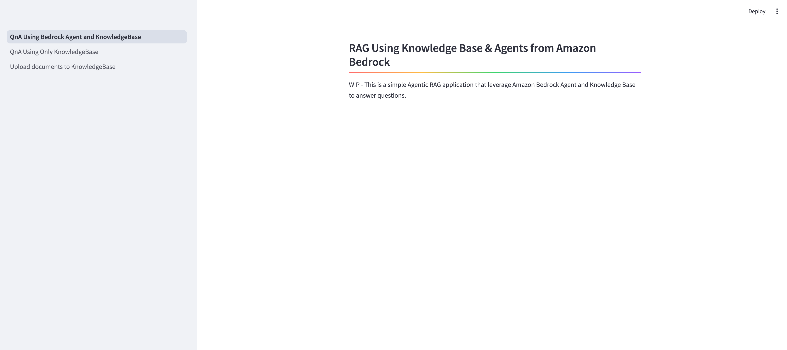

# Agentic Retrieval-Augmented Generation (RAG) Q&A Chatbot - leveraging Amazon Bedrock Knowledge bases & Agents.
## Agentic Q&A ChatBot

This project provides a step-by-step guide to create Amazon Bedrock Knowledge Bases (with a Opensearch Serverless Vector database) and Agents  using `boto3`along with a sample Streamlit QA chatbot (ChatBot is WIP - Coming soon)

## Prerequisites
- **AWS Account**: You will need an AWS account with the necessary permissions to create and manage Bedrock Knowledge Bases, Agents, and associated resources. <a href="https://repost.aws/knowledge-center/create-and-activate-aws-account">Create one if required</a>
- **Profile Setup**: <a href="https://docs.aws.amazon.com/cli/latest/userguide/cli-configure-files.html">Setup AWS Shared Credential File</a>
- **Python 3**: The project uses Python 3, so you'll need to have it installed on your system.
- **Python virtual env** (Optional):

   To manually create a virtualenv on MacOS and Linux:

   ```python3 -m venv .venv```

   After the init process completes and the virtualenv is created, you can use the following step to activate your virtualenv.

   ```source .venv/bin/activate```

   If you are on a Windows platform, you would activate the virtualenv like this:

   ```.venv\Scripts\activate.bat```

   Once the virtualenv is activated, you can install the required dependencies.

   ```pip install -r requirements.txt```


- **Boto3**: The project uses the Boto3 library to interact with AWS services. You'll need to install it using `pip install boto3`.
- **Streamlit**: The project uses Streamlit to build the QA chatbot. You'll need to install it using `pip install streamlit`.

## Deployment

### Create Amazon Bedrock Components using boto3 [Backend]
1. Clone the repository
   ```
   git clone git@github.com/anandmandilwar/agentic-rag-with-bedrock-agent-Kb.git
   ```
2. create a .env file at the root of the project folder. Copy the existing .env_sample and rename it as ".env". Make sure to update the AWS Account ID and AWS Region based on your environemnt. Rest other variables are for later use when launching the frontend application.

3. For this sample, I have downloaded publicly available Quaterly Investment Perspective (QIP) document available online at https://www.bessemertrust.com/insights/2025-a-strong-foundation-for-a-year-of-transition. and the same is used as the data source while creating the KnowledgeBase. Make sure to place this file under `src\deploy\data` directory. 
   
4. Navigate to the `src/deploy` directory in your project.
   ```
   cd agentic-rag-with-bedrock-agent-Kb/src/deploy
   ```
5. Run the `create_bedrock_components.py` script to create the Bedrock Knowledge Base, Agent, and associated resources.
   ```
   python create_bedrock_components.py
   ```
6. This script will set up the entire stack, including the necessary roles, S3 buckets, OpenAI schema, and Lambda function. If you need to update the reference document or add additionals documents to knowledge base, you can do so by uploading a new PDF file to the `documents` folder in the `src`. You have to manually resync the KnowledgeBase.

7. Navigate to the `src/` directory in your project.
   ```
   cd agentic-rag-with-bedrock-agent-Kb/src
   ```

8. To test the backend resources deployed. Run the python script `call_bedrock_agent.py`. Script is now hardcoded with one of the sample prompts. Also, make sure your `.env` is updated with bedrock agent ID and Agent Alias ID (which you get once the resources are deployed using step 5 above).
   ```
   python call_bedrock_agent.py
   ```


### Work in Progress - Sample QA Chatbot [FrontEnd]
1. Navigate to the `src/app` directory in your project.
   ```
   cd agentic-rag-with-bedrock-agent-Kb
   ```
2. Run the `QnA_Using_Bedrock_Agent_and_KnowledgeBase.py` script to start the Streamlit QA chatbot.Its a multi page App. You will have the option to do the Q&A using ONLY Knowledge Base or using both - KnowledgeBase and bedrock Agent.
   ```
   streamlit run QnA_Using_Bedrock_Agent_and_KnowledgeBase.py
   ```
3. This will launch the Sample QA chatbot, which you can use to interact with the Bedrock Knowledge Base and/or Bedrock agent.


